# bgmgo

A lightweight CLI tool to subscribe to anime bamgumi.

# Install

`go get github.com/myzWILLmake/bgmgo`

or

[get binary releases](https://github.com/myzWILLmake/bgmgo/releases) (You may need to change name of the binary file, and puth it in your PATH manually)

# Usage

First, make sure the aria2 service has run successfully. For the current build of bgmgo, only aria2 is supported as the download service. The default work direction folder is `$HOME/.bgmgo`, the config file is `config.json`.

The default aria2-rpc address is `http://localhost:6800/jsonrpc`. And default aria2-rpc token is `""`, which means no password set. You could change them in the config file.

Bgmgo downloads files by magnet links searched from:

- [bangumi.moe](https://bangumi.moe/)(default)
- [dmhy](https://share.dmhy.org/)
- [nyaa](https://nyaa.si)

You could change the data srouce in config file (`data-source`), or by flags (`-s [data-srouce]`). 

## Find Magnet Links

`bgmgo find [pattern]`

Use a pattern to help you find the specific anime title. Pattern is like the keywords you type in the search bar and use space to split keywords.

## Add/Remove Subcriptions

`bgmgo sub [pattern] [name]`

Use `bgmgo sub` to subscribe to the anime when you find the result from `bgmgo find` is unique. Recommend use the full title of the anime as the name. The name could be used as the download folder name, the folder only contains files with this title.

`bgmgo sub [sub-number ...]`

Use `bgmgo unsub` to unsubscribe the anime when you don't want to check it update. Multiple sub-numbers are supported.

## List Subscriptions

`bgmgo list`

## Update Subscriptions

`bgmgo update`

Use `bgmgo update` to update all your subscriptions. If there are new episodes, bgmgo would send all magnet links to aria2 to start download tasks. Then update the anime's progress to the lastest episode number.

# How to Schedule

You could use cron/crontab on *nix and schtasks on Windows. When new update episodes found, you can get notification from the system notification center.

## linux

Example: `0,30 * * * * /path/to/bgmgo update >> /home/user/.bgmgo/bgmgo.log`

Add this task to your crontab, it will run `bgmgo update` every 30 mins.

## Windows

Sorry, not test yet.
